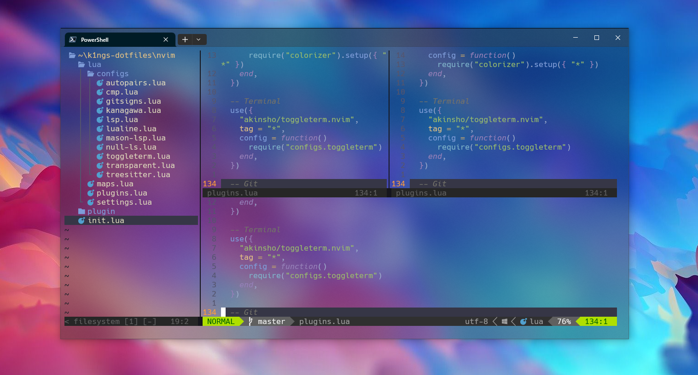

# K1ngs dotfiles
*Just my settings that I use on windows*

**Warning:** Don't blindly use my settings unless you know what entails. Use at your own risk!



## Contents
* vim (NeoVim) config
* PowerShell config

## Requirements
* Neovim >= v0.8.1
* Nerd Fonts - Powerline-patched fonts. I use Hack.
* NodeJS with npm

## PowerShell Setup
* [Scoop](https://scoop.sh/) - A command-line installer
* [Git](https://gitforwindows.org/)
* [Oh My Posh](https://ohmyposh.dev/) - Prompt theme engine
* [Terminal Icons](https://github.com/devblackops/Terminal-Icons) - Folder and file icons
* [PSReadLine](https://docs.microsoft.com/en-us/powershell/module/psreadline/) - Cmdlets for customizing the editing environment, used for autocompletion
* [z](https://www.powershellgallery.com/packages/z) - Directory jumper
* [PSFzf](https://github.com/kelleyma49/PSFzf) - Fuzzy finder

## Installation
1. Clone the repository.
```git
git clone https://github.com/k1ngs/dotfiles.git
```

2. Move nvim directory from `/dotfiles/.config` to 
* Windows: `$env:LOCALAPPDATA\nvim\`
* Linux: `~/.config/nvim`

3. Run the command in Neovim Editor:
```
:PackerSync
```
